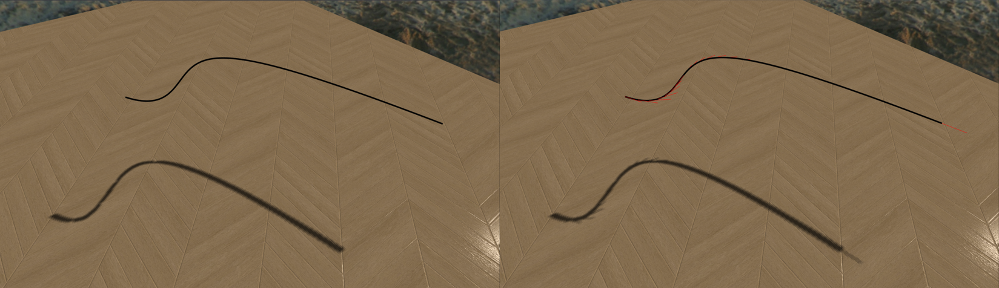
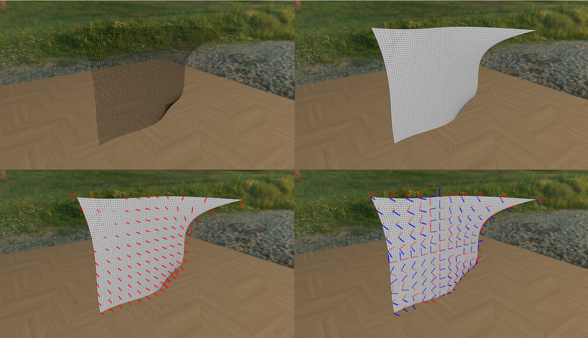
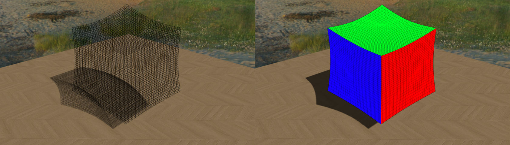

# MinuteFreeform

  

**C++ library that supports basic geometric operations related to non-rational freeform geometric entities :  Bezier/Bspline Curves, Surfaces, and Volumes**

This library supports following functionalities :
- For given degree, knots, and control points, build freeform curve, surface, and volume
- For given parameter, compute point and derivative on the freeform entity
- Convert between Bezier and Bspline formats : especially, Bezier form of Bspline entity is automatically calculated and used for acceleration
- For given parameter or parameter domain, subdivide the freeform entity or extract subset of it

# Curve
This library supports non-rational Bezier/Bspline curves in 2D/3D space. This library supports following functionalities for curves :
- For given parameter, compute **curvature** of the curve

The picture below shows simple 3D Bezier curve and its derivatives at some sample points.

  

# Surface
This library supports non-rational Bezier/Bspline surfaces in 2D/3D space. This library supports following functionalities for surfaces :
- For given parameter, compute **normal vector** of the surface
- For given parameter, compute **curvature information - Gaussian and Mean curvature, Principal directions and curvatures -** of the surface

The picture below shows simple 3D Bezier surface, its normal vectors, and its principal directions at some sample points.

  

# Volume
This library supports non-rational Bezier/Bspline volumes in 3D space. The picture below shows simple 3D Bezier volume.

  

